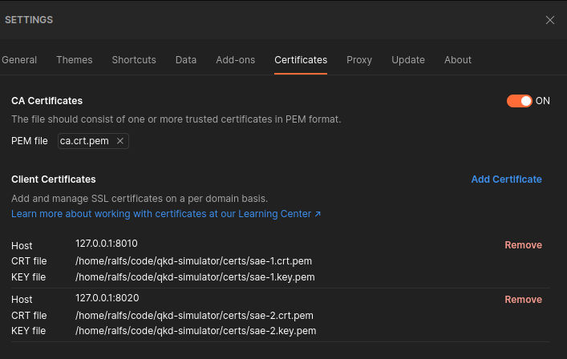

# Next Door Key Simulator

Quantum key distribution (QKD) key management entity (KME) simulator based on
the [ETSI GS QKD 014 V1.1.1](https://www.etsi.org/deliver/etsi_gs/QKD/001_099/014/01.01.01_60/gs_qkd014v010101p.pdf)
standard.

## Abbreviations

- CA - Certificate Authority
- KME - Key Management Entity (server)
- SAE - Secure Application Entity (client)
- QKD - Quantum Key Distribution

## Requirements

- Docker
- Docker Compose

## Installation

1. `git clone https://github.com/CreepPork/next-door-key-simulator`
2. `cd next-door-key-simulator`
3. `bash ./certs/generate.sh`
4. `docker compose up -d`

## Introduction

In the Docker Compose file there are 2 KMEs and for each KME there is 1 SAE.
If you want, you can modify the example and use only 1 KME and 1 SAE.

The KMEs communicate with each other using proprietary endpoints to share the generated keys between the other KMEs. (
This would be implemented by a real KME using quantum protocols).

The KMEs discover each other by only giving their host address (configurable in the `OTHER_KMES` environment variable).

### Implementation details

**Do not use** this _simulator_ in any type of production environment because, in no way, this simulator is secure.

The given QKD KME simulator currently only supports `POST` method on `/enc_keys` and `/dec_keys` endpoints, no support
for `GET` is given.

### Troubleshooting

#### Socket hang up

As per the standard, there is an authentication process with mututal TLS certificates.
If this error occurs the most likely reason, is that you are not giving the client TLS certificates.

If you are using Postman, this can be easily enabled by:

- using the respective KME's SAE auto-generated certificates (available in the `certs` directory);
- and [configuring Postman](https://learning.postman.com/docs/sending-requests/certificates/#adding-client-certificates)
  as follows: Cog > Settings > Certificates > Client Certificates > Add Certificate.



#### Waiting for response

Sometimes, the Docker containers will get stuck and are not either responding to user requests, or doing any kind of
sync operations between the KMEs.

It might be caused by host network interruptions, both containers starting at the same time and not being able to
connect, and possibly more scenarios.

The best option, is to just restart either 1 or both containers using this command in your terminal:

```bash
docker compose restart
docker compose logs -f
```

This will restart both containers, and afterward enter following mode for the console logs. Then you should see the new
log entries starting to appear.